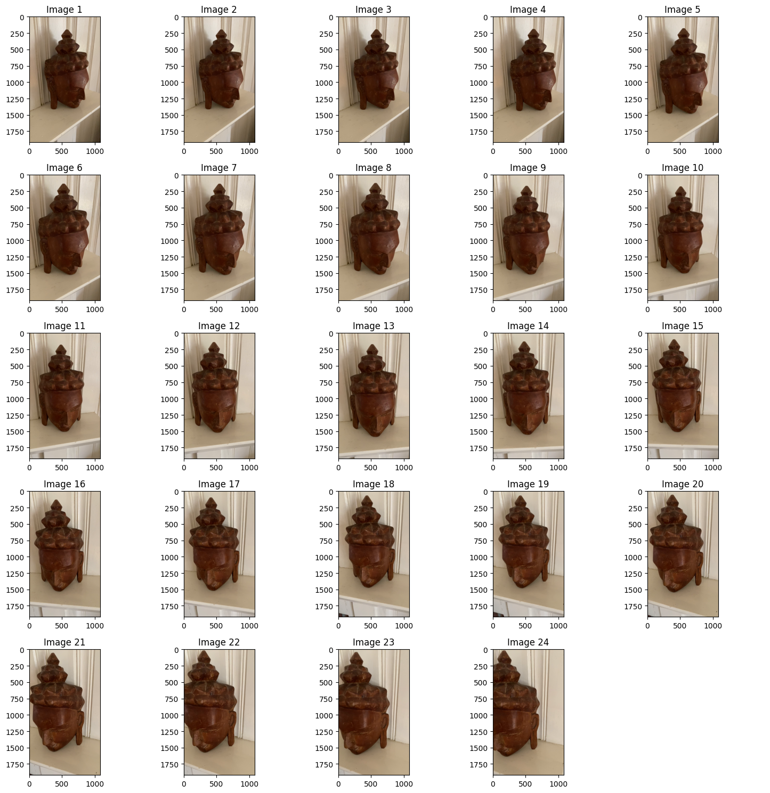

---
title: 3D Reconstruction Using Structure From Motion (SfM)
summary: 3D Reconstruction 
date: 2024-11-24
type: docs
math: false
tags:
  - Python, GTSAM, Computer Vision
image:
  caption: 3D Reconstruction
--- 

## Objective
To reconstruct a 3D scene and camera trajectory from a sequence of images using Structure-from-Motion (SfM). The pipeline includes feature detection, pose estimation, 3D point triangulation, and bundle adjustment for optimization.

## Dataset

**Source**: A custom dataset of images depicting a static scene ("buddha_images").
**Details**: The dataset consists of 25 images captured from different perspectives, simulating real-world camera motion around the object.

<it>Original Dataset</it>

**Preprocessing:**
        Images are normalized to ensure uniform pixel intensity.
        CLAHE (Contrast Limited Adaptive Histogram Equalization) is applied for better feature detection in low-contrast regions.

<it>Preprocessed dataset</it>

## Problem Statement

The goal is to accurately reconstruct the 3D structure of the scene and estimate the camera trajectory by:

1.  Detecting and matching features across the images.
2.  Estimating relative camera poses and 3D points.
3.  Refining the reconstruction with bundle adjustment to minimize reprojection errors.

## Workflow
**1. Image Preprocessing**

    Images are loaded and enhanced to improve feature detection.
    Conversion to grayscale and CLAHE is applied for contrast improvement.

**2. Feature Detection and Matching**

    SIFT (Scale-Invariant Feature Transform) is used to detect robust keypoints in each image.
    Keypoints are matched between consecutive images using FLANN-based matching.
    RANSAC is applied to eliminate outliers and ensure reliable matches.

**3. Pose and Structure Estimation**

    Fundamental Matrix: Estimated using RANSAC for epipolar geometry constraints.
    Essential Matrix: Extracted from the fundamental matrix to estimate relative camera poses.
    3D Point Triangulation: Feature correspondences are triangulated to estimate initial 3D points.

<it>Epipolar lines</it>
**4. Bundle Adjustment**

    Framework: GTSAM is used to build a factor graph that models the relationship between camera poses and 3D points.
    Optimization:
        Camera poses and 3D points are refined by minimizing reprojection errors.
        The Levenberg-Marquardt algorithm is employed for nonlinear optimization.

**5. Visualization**
    The 3D reconstruction is visualized as:
        A point cloud representing the reconstructed scene.
        A trajectory showing the path of the camera during image capture.
## Output

<it>Without Bundle Adjustment</it>

<it>With Bundle Adjustment</it>

<it>Output image</it>

## Did you find this page helpful? Consider sharing it 🙌
