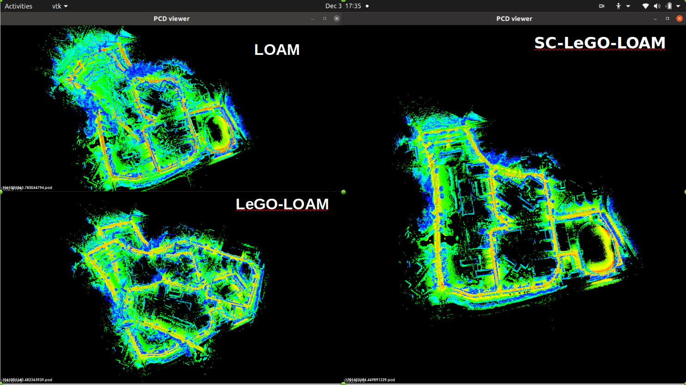

## Introduction

In this project, we systematically examined and compared various algorithms within the LOAM series,
specifically ALOAM, LEGO-LOAM, and SC-LEGO-LOAM. Our primary focus was on meticulously analyzing the developmental
trajectory from a singular lidar odometry approach (the original LOAM) to the comprehensive SLAM systems, namely Lego-
LOAM and SC-LEGO-LOAM. This comprehensive analysis involved intricate comparisons between algorithms, elucidation
of improvements made, and in-depth assessments. Ultimately, we conducted thorough testing and comparison of these three
algorithms on two extensive long-distance datasets

## Evaluation and Metrics

**Table 1: ATE of LeGO-LOAM and SC-LeGO-LOAM in Kaist sequence** 

$$
\begin{array}{|l|c|c|}
\hline
\textbf{Metric} & \textbf{SC-LeGO-LOAM (\%)} & \textbf{LeGO-LOAM (\%)} \\ \hline
\text{max} & 1.60 & 2.55 \\ \hline
\text{mean} & 0.84 & 1.03 \\ \hline
\text{median} & 0.82 & 1.01 \\ \hline
\text{min} & 0.08 & 1.35 \\ \hline
\text{rmse} & 0.90 & 1.13 \\ \hline
\end{array}
$$


**Table 2: ATE of LeGO-LOAM and SC-LeGO-LOAM in Riverside sequence**

$$
\begin{array}{|l|c|c|}
\hline
\textbf{Metric} & \textbf{SC-LeGO-LOAM (\%)} & \textbf{LeGO-LOAM (\%)} \\ \hline
\text{max} & 2.89 & 8.55 \\ \hline
\text{mean} & 1.35 & 2.82 \\ \hline
\text{median} & 1.36 & 3.34 \\ \hline
\text{min} & 0.20 & 0.27 \\ \hline
\text{rmse} & 1.46 & 3.34 \\ \hline
\end{array}
$$


<it> Fig 1. Point Cloud Comparison on RIVERSIDE 03 Dataset </it>

<it>Fig 2. Point Cloud Comparison on KAIST 01 Dataset</it>

The mapping results of three algorithms on the Kaist dataset
are illustrated in Figure 1 and Figure 2.
 

<it>Fig 3. LOAM on RIVERSIDE Dataset</it>

<it>Fig 4. LeGO-LOAM on RIVERSIDE Dataset</it>

<it>Fig 5. SC-LeGO-LOAM on RIVERSIDE Dataset</it>

<it>Fig 5. SC-LeGO-LOAM on RIVERSIDE Dataset</it>

## Output

**Map**
Here are the map formed by the LOAM Algorithm on the MulRAN Dataset(KAIST track):


## MORE VIDEOS WILL BE ADDED SOON 

## Did you find this page helpful? Consider sharing it 🙌
