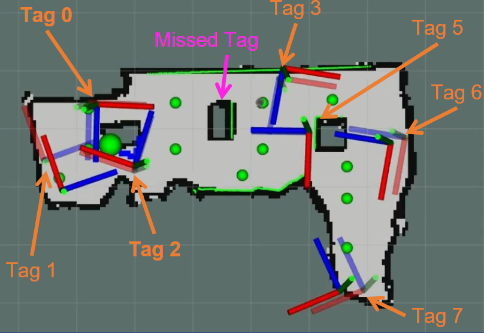

## Introduction

In response to the critical need for effective
reconnaissance in disaster scenarios, this research article
presents the design and implementation of a complete
autonomous robot system using the Turtlebot3 Burger (TB3)
with Robot Operating System (ROS) Noetic. Upon deployment
in closed, initially unknown environments, the system aims to
generate a comprehensive map and identify any present ’victims’
using AprilTags as stand-ins. We discuss our solution for search
and rescue missions, while additionally exploring more advanced
algorithms to improve search and rescue functionalities. We
introduce a Cubature Kalman Filter (CKF) to help reduce
the Mean Squared Error (MSE) [m] for AprilTag localization
and an information-theoretic exploration algorithm to expedite
exploration in unknown environments. 

This project we addresses the need for an autonomous robotic
system that can both map unknown, closed environments and
identify "victims(AprilTags)" in these settings. Our goal is
to design and implement a robust system using the Robot
Operating System (ROS) Noetic, which can:

• Generate a complete occupancy grid map of an unknown
environment, providing essential data for navigation and
strategic planning.

• Locate and accurately estimate the poses of "victims,"
represented by AprilTags, to simulate the identification
and location of individuals in need of rescue.

## Method
**Frontier Detection1 (background):**   ​

Detection of new frontier cells (and erase old ones). ​

Form frontiers from frontier cells. ​

​

**Compute Exploration Goal2,3 (service request):​**

Sample free points around each frontier's centroid.​

Compute gain for each point (optimizes yaw)​

Return highest gain pose as exploration goal.

## Videos
**Demo Video Trial 1**


**Demo Video Trial 2**


<it>Final Map and Tag Location</it>

**Read more about it on  [!Report](2404.13767v1.pdf)**

 

