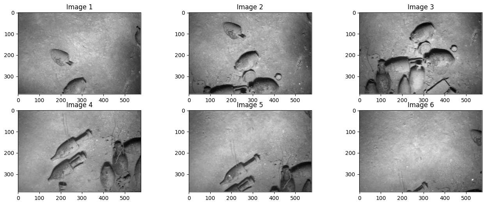
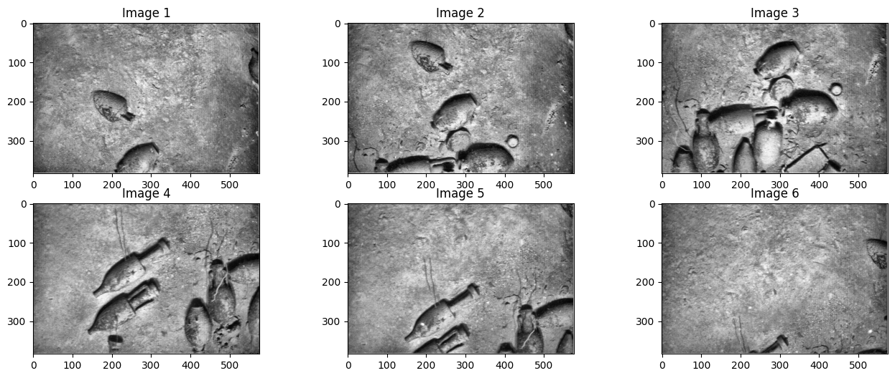
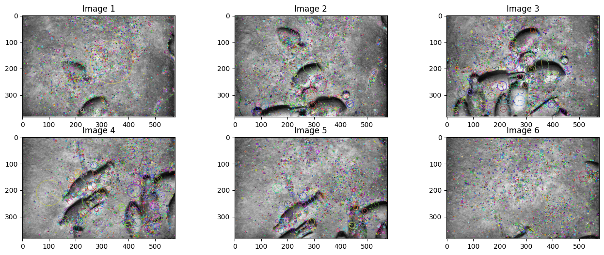
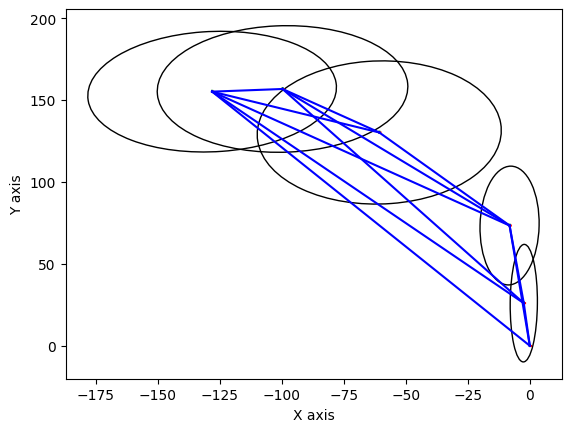
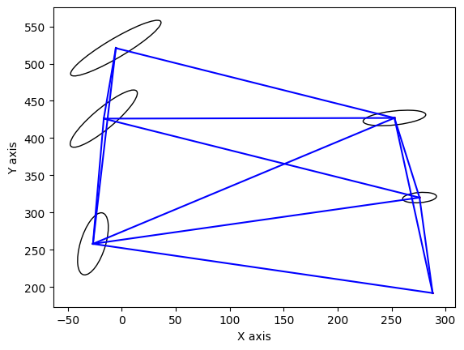
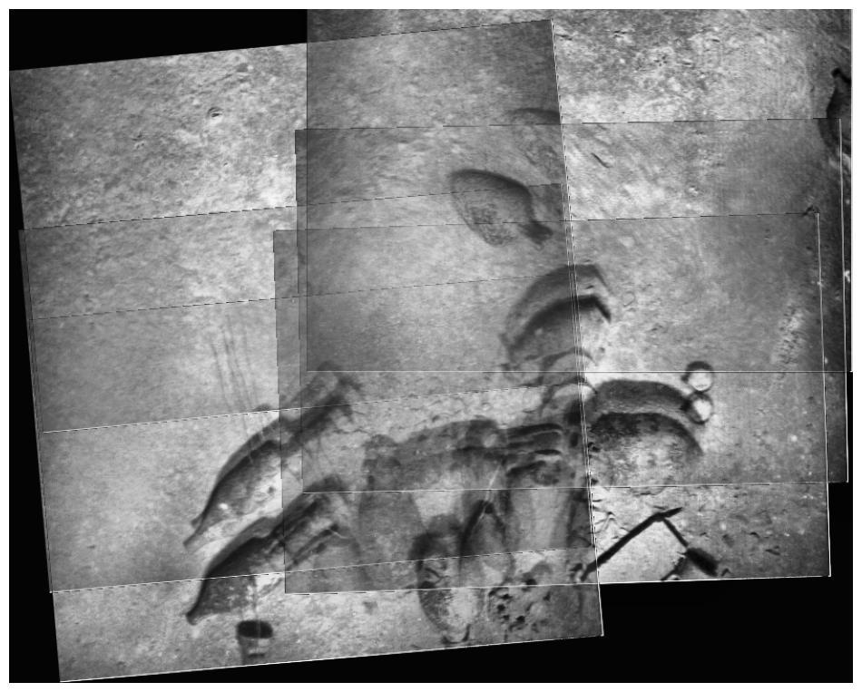
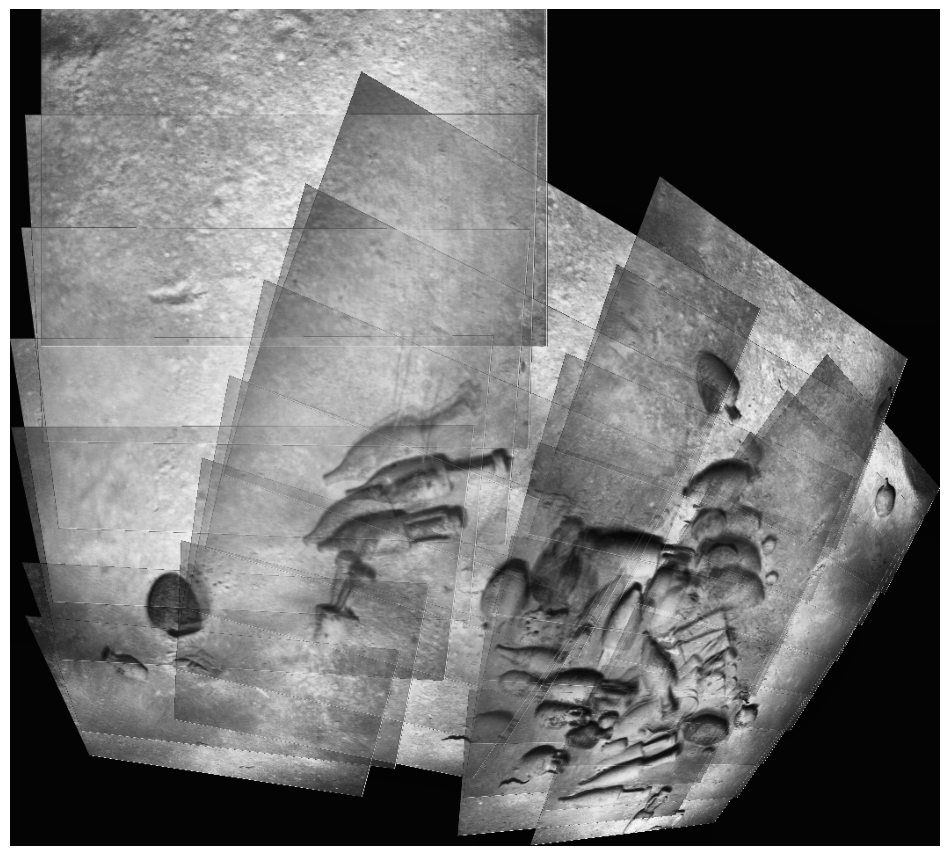
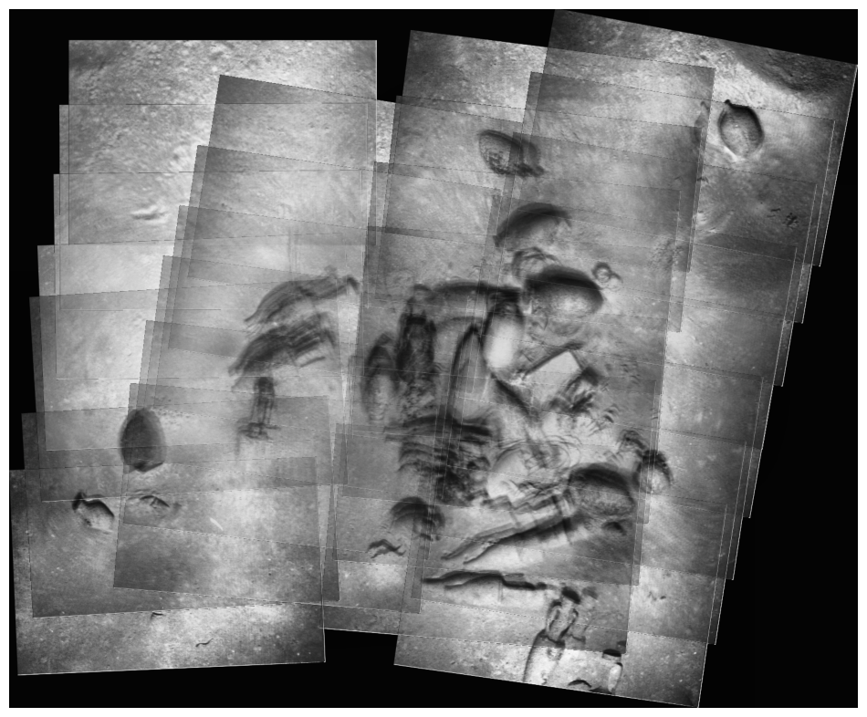

## Introduction

In this project I worked on the understanding of image registration by working on a low contrast, somewhat challenging dataset. 

The paper describing the work for photomosaicking is attached [!Pizarro2003joe.pdf](pizarro2003joe.pdf). I wanted to read this paper and see if we can duplicate some of the work in it while using some of the techniques I have learned in the class so far. 

## Output
There are 2 set of images I worked with 2 set of images each containing 6 images and 128 images.

Steps involved are normalising the image, applying histogram equalization techniques like CLAHE, feature extraction and trying image registration. Next step I tried to use GTSAM and build a factor graph to get a better fit.

**Normalising and applying CLAHE to all the images**

<it>Normalised Images</it>

<it>CLAHE Images</it>

<it>SIFT Images</it>

<it>Factor graph before Optimization for 6 image set</it>

<it>Factor graph after Optimization for 6 Image set</it>

<it>Output image after Optimization for 6 Image set</it>

<it>Output Image before Optimization for 128 Image set</it>

<it>Output Image after Optimization for 128 Image set</it>

 

